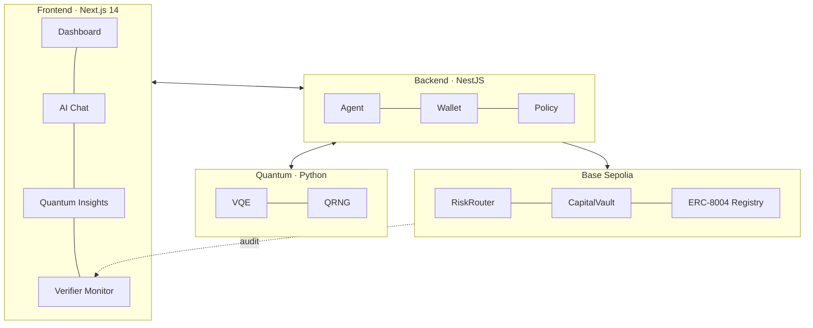

<div align="center">

# Captain Whiskers 🐱

**Trustless AI agent + quantum-aware treasury management — built for the LabLab AI Trading Agents Hackathon.**

<br/>


</div>

---

## TL;DR

Autonomous on-chain trading agent with **ERC-8004 identity**, **RiskRouter** limits, **Gemini**-driven execution, **VQE** portfolio optimisation, **post-quantum signatures** (CRYSTALS-Dilithium), and **Byzantine Fault Tolerant** 11-node verification. Explainable every step.

> 📖 **Full repo map & builder-guide** → [`REPO_GUIDE.md`](./REPO_GUIDE.md)
> 🏗️ **Standalone blueprint** (rebuild from scratch, no repo access) → [`STANDALONE_PROJECT_BLUEPRINT.md`](./STANDALONE_PROJECT_BLUEPRINT.md)
> 🏆 **Submission package** → [`docs/SUBMISSION_PACKAGE.md`](./docs/SUBMISSION_PACKAGE.md) · [`HACKATHON_EXECUTION.md`](./docs/HACKATHON_EXECUTION.md) · [`CAPITAL_SANDBOX.md`](./docs/CAPITAL_SANDBOX.md)

---

## Deployed contracts (Base Sepolia)

| Contract | Address |
|----------|---------|
| MockUSDC | _set in `.env`_ |
| MockWETH | _set in `.env`_ |
| RiskRouter | _set in `.env`_ |
| CapitalVault | _set in `.env`_ |

Explorer: [Base Sepolia](https://sepolia.basescan.org) · ERC-8004 agent: set `ERC8004_AGENT_ID` then view on [8004agents.ai/base](https://8004agents.ai/base).

Helper commands:

```bash
cd contracts
npm run verify:erc8004-registry
npm run post:reputation
npm run set:agent-uri
npm run submit:hackathon-intent
npm run upload:agent-card

# Demo
npm run demo-recording
```

---

## Features

### 🧠 AI-powered treasury
- **Gemini** Flash/Pro for natural-language trade instructions
- **Function calling** for automated execution based on user intent
- **Explainable AI** — Captain Whiskers mascot narrates every decision

### ⚛️ Quantum
- **VQE portfolio optimisation** — Variational Quantum Eigensolver for Markowitz
- **Qiskit** — ready for real quantum hardware
- **QRNG** — quantum random for cryptographic nonces

### 🔐 Post-quantum security
- **CRYSTALS-Dilithium** lattice signatures (quantum-resistant)
- **EIP-712** signing for x402 micropayments
- Quantum-safe key generation and storage

### 🛡️ BFT verification
- **11-node consensus**, tolerates 3 Byzantine
- **7 required signatures** (2f + 1 threshold)
- On-chain audit log

### 💳 x402 micropayments
- **Pay-per-call** automatic payment for API/data access
- **Pay-on-success** escrow-released on completion
- **Bundle payments** for efficiency
- Reliability scoring per provider (success rate + latency)

### 📊 Policy enforcement
- Per-transaction limits · daily caps · cooldown periods · price deviation guards

---

## Architecture



---

## Track context

Built for the **LabLab AI Trading Agents Hackathon** — ERC-8004 + optional Kraken tracks on **Base Sepolia**. Older docs reference *Arc × Circle*; that was an earlier program. This repo targets the current LabLab / Surge submission path.


---

<div align="center">
<sub>Part of <a href="https://github.com/pbathuri">@pbathuri</a>'s <a href="https://github.com/pbathuri/Map_Projects_MAC">project portfolio</a></sub>
</div>
