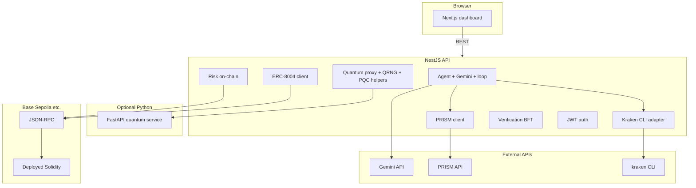

# Captain Whiskers — Standalone project blueprint

**Audience:** You have **only this file**. You do **not** have the repository. Your goal is to **understand why the system was built** and **how to recreate an equivalent system from zero**.

**What this is:** A hackathon-grade **agentic commerce / AI treasury** platform named *Captain Whiskers*. It combines a **web dashboard**, a **NestJS control plane**, optional **Python “quantum” microservice**, **Solidity contracts** (Base Sepolia–oriented), and integrations with **LLMs**, **market data APIs**, **Kraken** (CLI paper/live), and **ERC-8004** agent identity. The original developers framed it around **trust minimization**, **explainable agent decisions**, **simulated Byzantine verification**, and **quantum-themed** portfolio tooling—some layers are **production-shaped**, others are **demonstration** (in-memory DB, simulated verifiers).

---

## Part A — Developer intent

### A.1 Thesis

1. **Autonomous trading assistance:** An AI agent should accept **natural-language instructions**, combine them with **live or paper market context**, and produce **traceable decisions** (what to trade, why).
2. **Composable services:** Separate **UI**, **API**, **on-chain risk/identity**, and **quantum/math** into replaceable services so teams can demo **without** running every piece (e.g. SQLite memory + public RPC).
3. **Hackathon storytelling:** Surface **BFT verification** (11 nodes, 7-of-11 style threshold), **post-quantum** crypto hooks, **x402 / escrow** contracts, and **Arc / Base** testnets—narrative depth even when some modules are stubs or not wired into the main app module.
4. **Safe demo path:** **Paper trading** via **Kraken CLI** avoids real funds; **Gemini** powers NL understanding; **PRISM** enriches signals when keys exist.

### A.2 Non-goals (as implemented)

- **Not** a fully audited production exchange or custodial product.
- **Circle** and **micropayment** Nest modules may exist in source trees but **are not always registered** in the main application module—treat as **optional / legacy wiring**.
- **Quantum service** may run as a **thin FastAPI** placeholder; heavier Qiskit/VQE can be layered in later.

### A.3 Design choices (why these technologies)

| Choice | Intent |
|--------|--------|
| **Monorepo (npm workspaces + Turborepo)** | One clone; shared types package; coordinated `dev`/`build`. |
| **NestJS** | Structured modules, Swagger, guards, scheduling (`@Cron`), TypeORM. |
| **Next.js 14 App Router** | Dashboard routes, SSR/CSR hybrid, `NEXT_PUBLIC_*` config. |
| **TypeORM + better-sqlite3 OR Postgres** | Fast local demo (`USE_POSTGRES=false`) vs persistent deploy. |
| **ethers v6** | Base Sepolia RPC, wallets, contract calls for risk + ERC-8004. |
| **Kraken CLI** | Paper portfolio and market data without building a full exchange adapter first. |
| **Gemini API** | Function-calling style flows for `instruct` and trading loop. |
| **Hardhat** | Solidity compile/deploy for treasury, escrow, mocks, risk router. |

---

## Part B — What the system does (behavioral spec)

### B.1 User-visible capabilities

- **Landing + docs** pages; **dashboard** with chat, wallet, quantum, verification, history, settings, trading/risk/identity/leaderboard views (exact routes are implementation details; conceptually: **one shell layout**, **multiple feature pages**).
- **Wallet connect** (e.g. Wagmi + WalletConnect project id) for **read-only / signing** flows as configured.
- **Agent chat / instruct:** POST natural language → backend uses **Gemini** + tool calls to **paper trade**, consult **PRISM** signals/risk when available.
- **JWT auth** for some agent routes (`/agent/decide`, etc.); **public** routes for Kraken market, paper endpoints, Swagger-documented APIs.

### B.2 Autonomous loop (optional, env-gated)

- If `TRADING_LOOP_ENABLED=true`, a **cron job** (e.g. every minute) pulls **Kraken market + PRISM + paper portfolio**, asks **Gemini** for a decision, **executes function calls** (paper trades), logs cycles to DB, optionally interacts with **risk / ERC-8004** when configured.
- If `TRADING_LOOP_INIT_PAPER=false`, skip initial paper init on boot.

### B.3 On-chain (optional)

- **RiskRouter / CapitalVault / mocks:** When addresses are in env, backend can **validate** trades against deployed contracts.
- **ERC-8004:** Register **agent identity** / URI on **Base Sepolia** using known registry addresses; requires a valid **hex `AGENT_PRIVATE_KEY`** (not an exchange API secret).

### B.4 Verification layer (simulation)

- **11 verifier nodes**, **f = 3** Byzantine tolerance, **2f+1 = 7** signatures required—implemented as a **service** with persisted logs, **not** necessarily 11 independent processes unless extended.

---

## Part C — Architecture (recreate this shape)



**Data flow (instruct):** Browser → `POST /api/agent/instruct` → load paper **status** + optional **PRISM** signals/risk → **GeminiTradingService.processInstruction** → execute tool calls (paper buy/sell, etc.) → JSON response.

**Data flow (trading loop):** Scheduler → market scan + signals + portfolio → Gemini → execute calls → **TradingCycleLog** (entity) + performance snapshots.

---

## Part D — Repository layout you would recreate

You do not have the repo; recreate **conceptually**:

```text
captain-whiskers/
  package.json              # workspaces: apps/backend, apps/frontend, apps/quantum-service, packages/*
  turbo.json
  .env.example
  apps/
    backend/                # NestJS — primary API
    frontend/               # Next.js 14 — dashboard
    quantum-service/        # FastAPI — optional
  contracts/                # Hardhat + Solidity
  packages/shared/          # Shared TS constants (chain id, ERC-8004 addresses)
  deployment/               # docker-compose, hosting notes
  scripts/                  # e.g. demo curl script
```

---

## Part E — Backend specification (NestJS)

### E.1 Bootstrap

- **`main.ts`:** Create Nest app, CORS from `FRONTEND_URL`, global `ValidationPipe`, Swagger at `/api`, listen `PORT`/`BACKEND_PORT`.
- **Before app creation:** Resolve **Base Sepolia RPC**: if `BASE_SEPOLIA_RPC` set → use; else if `ALCHEMY_API_KEY` → `https://base-sepolia.g.alchemy.com/v2/<key>`; else `https://sepolia.base.org`.
- **`app.module.ts`:** `ConfigModule` with `envFilePath` including cwd, parent, grandparent (so `.env` at monorepo root loads). `TypeOrmModule`: if `USE_POSTGRES=true` and valid `DATABASE_URL` → Postgres + SSL as configured; else **better-sqlite3** `:memory:` for demo. `ScheduleModule.forRoot()`. Import feature modules (see below).

### E.2 Modules to implement (feature boundaries)

| Module | Responsibility |
|--------|----------------|
| **Auth** | Register/login, JWT strategy, `User` entity. |
| **Agent** | Decisions, history, explain; **AgentInstructController** at `/api/agent/instruct`; **GeminiTradingService**; **TradingLoopService** + cron; **PerformanceService**; entities: `AgentDecision`, `TradingCycleLog`. |
| **Kraken** | Wrap `kraken` CLI: **paper** init/buy/sell/status/history; **market** ticker/OHLC. Expose under `/api/kraken/...`. |
| **Prism** | HTTP client: price, signals, risk per symbol. |
| **ERC8004** | `ethers` wallet from `AGENT_PRIVATE_KEY` if valid hex; register agent URI; identity entity; `/api/identity/...`. |
| **Risk** | If `RISK_ROUTER_ADDRESS` set, validate intents on-chain via `ethers`. |
| **Aerodrome** | Config/hooks for router/factory/WETH addresses (swaps reference). |
| **Wallet** | User wallet entities, balances, transactions API. |
| **Policy** | Spending limits / cooldown config entity + enforcement. |
| **Reliability** | Provider scoring for “best provider” style demos. |
| **Verification** | BFT simulation, verifier nodes, logs, thresholds 11/7. |
| **Quantum** | Proxy to `QUANTUM_SERVICE_URL`; QRNG + post-quantum helper services; `/quantum/optimize` etc. |

**Optional / may exist unregistered:** **Circle**, **Micropayment** — implement only if you need those demos; original app may not import them.

### E.3 Key HTTP routes (recreate contract)

**Public / lightly guarded (check guards in implementation):**

- `GET /` — health message.
- `POST /auth/register`, `POST /auth/login`.
- **Kraken:** `GET /api/kraken/ticker/:pair`, `GET /api/kraken/market/ohlc/:pair`, `POST /api/kraken/paper/init`, `POST /api/kraken/paper/buy`, `POST /api/kraken/paper/sell`, `GET /api/kraken/paper/status`, `GET /api/kraken/paper/history`.
- **Agent instruct:** `POST /api/agent/instruct` body `{ "instruction": string }`.
- **Agent metrics:** `GET /api/agent/performance`, `GET /api/agent/cycles`.
- **PRISM:** under `/api/prism/...` (resolve price, signals, risk).
- **Identity:** `POST /api/identity/register`, `POST /api/identity/feedback`, `GET /api/identity/status`.
- **Risk:** `POST /api/risk/validate`.
- **Verification / reliability / policy / quantum** — as per controllers.

**JWT Bearer (`/agent/...` pattern):** `POST /agent/decide`, `POST /agent/execute/:id`, `GET /agent/explain/:id`, `GET /agent/history`.

### E.4 Utilities

- **`isValidHexPrivateKey`:** 64 hex chars, optional `0x` — reject API secrets wrongly pasted as keys.
- **RPC resolution** as in Part E.1.

---

## Part F — Frontend specification (Next.js)

### F.1 Stack

- **Next.js 14**, App Router, **Tailwind**, **TanStack Query**, **wagmi** + **Web3Modal** (or similar), **Recharts** where charts exist.
- **`NEXT_PUBLIC_API_URL`** → Nest backend; **`NEXT_PUBLIC_QUANTUM_API_URL`** → Python service; **`NEXT_PUBLIC_WALLETCONNECT_PROJECT_ID`** for wallet modal.

### F.2 Pages (conceptual)

- **Marketing home** + **docs**.
- **Dashboard** subtree: main dashboard, **chat**, **wallet**, **quantum**, **verification**, **history**, **settings**, **circle**, **identity**, **trading**, **risk**, **leaderboard**.
- **Root `layout`:** fonts, dark theme, **`Providers`** (QueryClient + wagmi).

### F.3 Client

- Central **`lib/api.ts`** (or equivalent) for `fetch` to backend.

---

## Part G — Quantum service (Python)

### G.1 Minimal viable product

- **FastAPI** app, CORS open for local dev.
- **`GET /health`** → `{ status, service }`.
- **`GET /optimize`** → placeholder weights object (backend may call this for demos).

### G.2 Extensions (original intent)

- **Portfolio optimizer** module (Markowitz / risk parity / VQE placeholder).
- **QRNG** and **Dilithium**-style helpers in separate modules; wire only if dependencies and security review allow.

---

## Part H — Smart contracts (Solidity + Hardhat)

### H.1 Contracts to implement (names from project)

| Contract | Role |
|----------|------|
| **CaptainWhiskersTreasury** | Treasury custody / allocation logic for demo. |
| **BFTVerification** | On-chain verification bookkeeping (paired with off-chain BFT story). |
| **X402Escrow** | Escrow for micropayment / pay-per-call narratives. |
| **MockUSDC / MockWETH** | Testnet tokens for demos. |
| **RiskRouter** | On-chain checks consumed by backend **RiskService**. |
| **CapitalVault** | Vault for capital locking. |

### H.2 Tooling

- **Hardhat**, Solidity **0.8.24**, optimizer on.
- **Networks:** local `hardhat`, **`base-sepolia`** (chain id **84532**), optional **Arc** testnet/mainnet entries if you need that storyline.
- **Deploy scripts:** read `DEPLOYER_PRIVATE_KEY`, `BASE_SEPOLIA_RPC` (same resolution as backend: explicit RPC or Alchemy key).
- **Tests:** Foundry-style or Hardhat tests for treasury and risk router.

---

## Part I — Environment variables (complete conceptual list)

Copy pattern: **one `.env` at monorepo root** consumed by backend (nested search paths) and by Hardhat via `dotenv` path to parent.

| Variable | Purpose |
|----------|---------|
| `KRAKEN_API_KEY` / `KRAKEN_API_SECRET` | Live Kraken (paper can work without). |
| `GEMINI_API_KEY` | LLM for agent instruct + loop. |
| `PRISM_API_KEY` | PRISM market intelligence API. |
| `BASE_SEPOLIA_RPC` | Explicit RPC URL (optional if using Alchemy). |
| `ALCHEMY_API_KEY` | If set and `BASE_SEPOLIA_RPC` empty → Alchemy Base Sepolia URL. |
| `BASE_SEPOLIA_CHAIN_ID` | e.g. `84532`. |
| `DEPLOYER_PRIVATE_KEY` / `DEPLOYER_ADDRESS` | Deploy contracts; fund with test ETH. |
| `AGENT_PRIVATE_KEY` / `AGENT_ADDRESS` | **Ethereum hex key** for ERC-8004 and signing; **not** Kraken secret. |
| `DATABASE_URL` | Postgres connection string when Postgres used. |
| `USE_POSTGRES` | `true` → Postgres; else in-memory SQLite. |
| `NODE_ENV`, `PORT`, `BACKEND_PORT` | Server mode and port (e.g. **3001**). |
| `FRONTEND_URL` | CORS origin (e.g. `http://localhost:3000`). |
| `JWT_SECRET` | Signing JWTs. |
| `RISK_ROUTER_ADDRESS`, `CAPITAL_VAULT_ADDRESS`, `MOCK_USDC_ADDRESS`, `MOCK_WETH_ADDRESS` | Deployed contract addresses. |
| `ERC8004_IDENTITY_REGISTRY`, `ERC8004_REPUTATION_REGISTRY` | ERC-8004 registry addresses on Base Sepolia. |
| `AERODROME_ROUTER`, `AERODROME_FACTORY`, `WETH_BASE` | DEX reference addresses. |
| `QUANTUM_SERVICE_URL` | Python service URL. |
| `TRADING_LOOP_ENABLED` | `true` to enable cron loop. |
| `TRADING_LOOP_INIT_PAPER` | `false` to skip paper init on startup. |
| `NEXT_PUBLIC_API_URL`, `NEXT_PUBLIC_QUANTUM_API_URL`, `NEXT_PUBLIC_WALLETCONNECT_PROJECT_ID` | Frontend. |

---

## Part J — Recreate from scratch (phased checklist)

### Phase 1 — Skeleton

1. Create **npm workspaces** monorepo with `apps/backend`, `apps/frontend`, `packages/shared`, root `package.json`, `turbo.json`.
2. Add **`.env.example`** (no secrets).

### Phase 2 — Backend MVP

1. `nest new` or manual Nest **AppModule** + `main.ts` + Swagger.
2. **ConfigModule** + **TypeORM** (SQLite memory first).
3. **Auth** (user + JWT) + **Kraken** module (CLI subprocess wrapper + DTOs).
4. **Prism** + **Gemini** modules; **AgentInstructController** + **GeminiTradingService** (tool calling).
5. **ERC8004** + **Risk** with `ethers` and env-gated addresses.
6. **TradingLoopService** + `@nestjs/schedule` + entity **TradingCycleLog**.
7. **Verification** + **Policy** + **Wallet** + **Reliability** as needed for your demo scope.

### Phase 3 — Frontend MVP

1. `create-next-app` App Router + Tailwind.
2. **`Providers`**: Query + wagmi config.
3. Dashboard routes and **`lib/api`** calls to backend.
4. Env: `NEXT_PUBLIC_*`.

### Phase 4 — Quantum service

1. FastAPI **main.py** + `/health` + `/optimize` placeholder.
2. Point **`QUANTUM_SERVICE_URL`** at it; optionally extend Python modules.

### Phase 5 — Contracts

1. Hardhat project under **`contracts/`**.
2. Implement Solidity files; **compile**; **deploy** to Base Sepolia; paste addresses into `.env`.

### Phase 6 — Ops

1. **Docker Compose** for Postgres + Redis + services if needed.
2. **CI**: `lint`, `test`, `build` on push.

---

## Part K — Security and operational notes

- **Never commit** real `.env` or private keys.
- **Separate keys:** Kraken API secrets ≠ Ethereum private keys; validating hex prevents misconfiguration crashes.
- **Public RPC** is rate-limited; **Alchemy** (or similar) for demos at scale.
- **Swagger** on `/api` in dev — disable or protect in production.

---

## Part L — How to know you succeeded

- Backend starts; Swagger loads; **paper Kraken** endpoints work if CLI installed.
- **`POST /api/agent/instruct`** returns a structured response when `GEMINI_API_KEY` is set.
- Frontend loads and can call **`NEXT_PUBLIC_API_URL`**.
- Optional: trading loop writes **cycle logs** when enabled; ERC-8004 registers when funded wallet + valid key.

---

*This document is intentionally self-contained. It describes intent and a faithful recreation path; naming and file paths may differ in your new implementation.*
